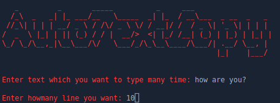

# Automated Text Typing and Clipboard Copy Script


This Python script provides a simple automation tool to type a specified text multiple times, with each instance separated by a newline character (\n). Additionally, it copies the generated text to the system clipboard. This can be useful for various tasks where repetitive typing is required, and you want to quickly copy the result to the clipboard for pasting into other applications.

<p align="center">
  
</p>


## Demo

INPUT

```bash

   _         _       _____          _     ___                  
  /_\  _   _| |_ ___/__   \_____  _| |_  / __\___  _ __  _   _ 
 //_\| | | | __/ _ \ / /\/ _ \ \/ / __|/ /  / _ \| '_ \| | | |
/  _  \ |_| | || (_) / / |  __/>  <| |_/ /__| (_) | |_) | |_| |
\_/ \_/\__,_|\__\___/\/   \___/_/\_\__\____/\___/| .__/ \__, |
                                                  |_|    |___/


Enter text which you want to type many time: how are you?

Enter howmany line you want: 10

```
OUTPUT

```bash
how are you?

how are you?

how are you?

how are you?

how are you?

how are you?

how are you?

how are you?

how are you?

how are you?

```
This tool work like this.
